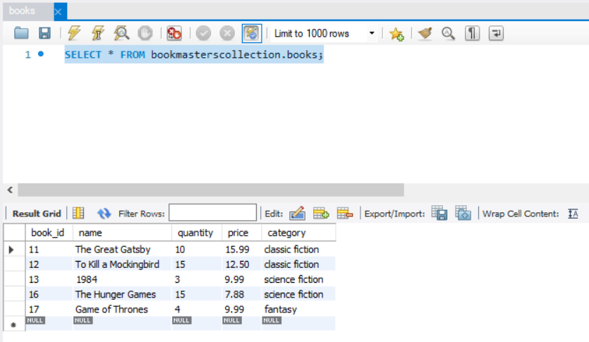

# Bookmaster's Collection
A simple but effective software to manage inventory at a bookstore.

# Install
1. clone the repo at: https://github.com/JoshuaMartinez1014/Bookmastercollection.git

# Database
1. Import the database dump file in your mysql workbench: for schema and dummy items
2. File located at: https://github.com/JoshuaMartinez1014/Bookmastercollection/blob/master/bookmasterscollection_books.sql

# Screenshots
## Functionality of the view all books
.png)
## Functionality of the view by categories
.png)
## Database mysql workbench bookmaster's data

   
